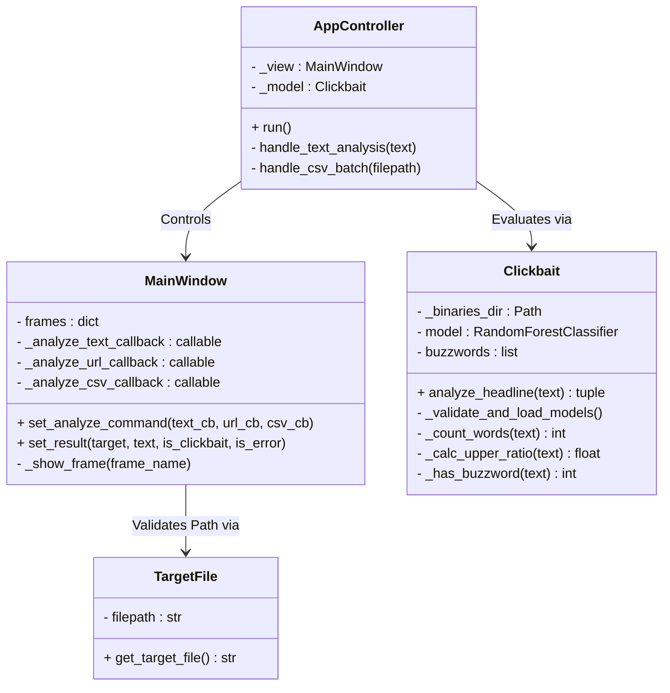

# Clickbait Analyzer

Clickbait Analyzer is a comprehensive desktop-based Machine Learning application designed to detect and classify clickbait headlines. It allows processing of individual text inputs, scraping URLs, and batch-analyzing entire CSV datasets, all backed by a robust AI model.

> **Note:** This documentation was created as a school project for SPŠE Ječná.

## How to run it?

* You can run the project using the [run.bat](../run.bat) file on your Windows device.
* The script automatically creates a Python virtual environment and installs necessary dependencies without needing a global setup.
* Alternatively, you can run the project in any development environment by executing the main `src/main.py` script.

## Specifications

* **Python 3.8+**
* **Trained ML Model** (randomforestmodel.pkl required in src/model/ml)
* **Libraries**:
    * `scikit-learn` & `tensorflow` (for predictive ML evaluation)
    * `pandas` & `numpy` (for fast batch dataset processing)
    * `customtkinter` (for modern UI layout rendering)

## Features (User Requirements)

* **Text Analysis**: Instantly determine the clickbait probability of any headline or string of text.
* **URL Content Analysis**: Input a webpage address, and the app extracts its content directly to evaluate clickbait prevalence.
* **Batch CSV Processing**: 
    * Bulk import large CSV files.
    * Dynamically switch between processing pure text items or URL links present in the dataset.
* **Responsive Visual Results**: Provides colored visual feedback indicating the likelihood of the content being "Clickbait".

## Architecture & Design Patterns

The project follows strict software engineering principles using **Python** and **CustomTkinter**:

1.  **MVC Architecture**: Separates Model (`Clickbait` evaluating AI logic), View (`MainWindow` rendering UI), and Controller (application flow).
2.  **Observer/Callback Pattern**: CustomTkinter UI buttons are decoupled from logic using injected callback routing methods (`_analyze_text_callback`).
3.  **Encapsulation**: Model and UI logics are safely boxed within isolated classes guarding class properties.

## Class Diagram (UML)

The following diagram illustrates the core class structure, highlighting the relationship between the visual interface, controlling logic, and the machine learning model.



## Example of Error Handling Flow
When a user attempts to input invalid data or corrupt datasets, the system handles it gracefully:

```python
try:
    # Trying to pick and open a protected or non-existing CSV dataset
    target = TargetFile(filepath)
    self.selected_csv_path = target.get_target_file
except PermissionError as e:
    # Safely flags the error on the graphical interface instead of crashing
    self.set_result("csv", f"Permission: {e}", is_error=True)
```

## About project

* **Version**: 1.0
* **Author**: Jan Vavroušek

## About me

* **Contact**: vavrousek@spsejecna.cz
* **School**: SPŠE Ječná
